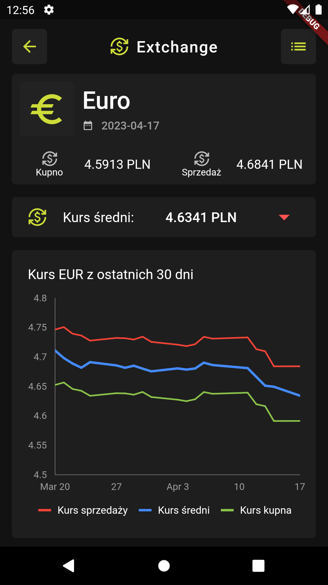

# extchange [[PL]](docs/PrzeczytajMnie.md) 
Android application showing exchange rates. Created using the Flutter framework.

## Description 
The purpose of the application is to present EUR and USD exchange rates downloaded from the public NBP API. It allows you to display a list of exchange rates for the selected currency from the last 30 days. Both in chart and table form.
  
The application has 3 pages:
*  Home page - containing a currency selection panel,

*  Detail page - containing information about the currency rate and a chart of currency rates from the last 30 days, 

*  Table page - containing a table of currency exchange rates from the last 30 days,

## Tools
* Dart 2.19.3
* Flutter 3.7.6

### Packages
* bloc: 8.1.1
* flutter_bloc: 8.1.2
* json_annotation: 4.8.0
* freezed_annotation: 2.2.0
* get_it: 7.2.0
* injectable: 2.1.0
* retrofit: 4.0.1
* dio: 5.0.3
* go_router: 6.4.1
* lottie: 2.3.0
* recase: 4.1.0
* auto_animated: 3.0.0
* pull_to_refresh: 2.0.0
* syncfusion_flutter_charts: 21.1.35
* shared_preferences: 2.1.0
* theme_provider: 0.5.0

## How to run
* Download provided apk file on your Android device
* install extchange.apk

## Future improvements
* Adding more currencies
* Adding internationalization

## Author
**Michał Popiel** - [ReQezeR](https://github.com/ReQezeR)

## License
[MIT](https://choosealicense.com/licenses/mit/)
